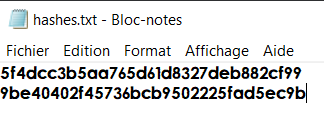

**hashcat** is the world's fastest and most advanced password recovery utility, supporting five unique modes of attack for over 300 highly-optimized hashing algorithms. hashcat currently supports CPUs, GPUs, and other hardware accelerators on Linux, Windows, and macOS, and has facilities to help enable distributed password cracking.


---

#### Utilisation

First, it is necessary to define the type of hash to find.

→ [Hash Analyzer - TunnelsUP](https://www.tunnelsup.com/hash-analyzer/)

We put the hash in a .txt file (hashes.txt)




We will also need the file rockyou.txt

→ [Download Rockyou.txt](https://github.com/brannondorsey/naive-hashcat/releases/tag/data)


#### Command

1. Help

	```bash
	hashcat -h
	```

2. Decode hash

	```bash
	hashcat -m [hash type] -a [attack type] -o cracked.txt hashes.txt rockyou.txt
	```


##### Example for a md5 hash

1. Command

	```
	hashcat -m 0 -a 0 -o cracked.txt hashes.txt rockyou.txt
	```


2. Display results

	→ cracked.txt
	
	or
	
	```
	hashcat --show -m 0 hashes.txt rockyou.txt
	```

